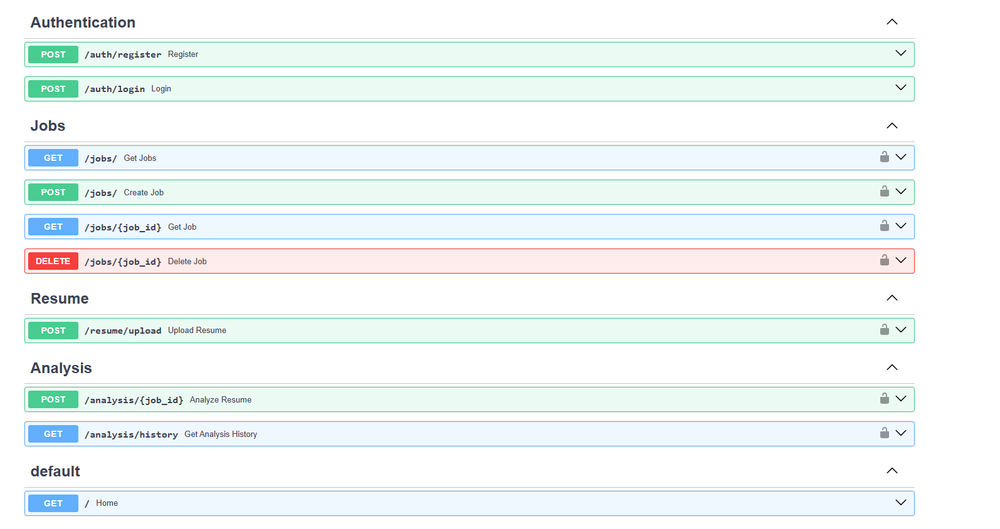

# 🚀 AI Resume Screening API

An AI-powered Resume Screening API built using **FastAPI**, **SQLAlchemy**, **JWT Authentication**, and **Groq LLM**. The API allows recruiters to create job descriptions, upload resumes, calculate ATS scores, identify missing skills, and generate AI-powered hiring feedback.

---

## 🌐 Live Demo

**API Base URL**

https://resume-screening-api-z2fi.onrender.com

**Swagger Documentation**

https://resume-screening-api-z2fi.onrender.com/docs

---

# ✨ Features

### 👤 Recruiter Authentication
- JWT Authentication
- Secure Password Hashing (bcrypt)
- Register/Login APIs
- Protected Routes

### 💼 Job Management
- Create Job
- View All Jobs
- View Single Job
- Delete Job

### 📄 Resume Parsing
- Upload Resume (PDF)
- Extract Candidate Name
- Extract Email
- Extract Phone Number
- Extract Technical Skills

### 📊 ATS Score Analysis
- Skill Matching
- ATS Score Calculation
- Match Percentage
- Missing Skills Detection

### 🤖 AI Feedback
Powered by **Groq Llama 3**

Generates

- Resume Summary
- Strengths
- Weaknesses
- Hiring Recommendation

### 📚 Analysis History

Stores every resume analysis including

- ATS Score
- Match Percentage
- Skills Matched
- Missing Skills
- AI Feedback

---

# 🛠 Tech Stack

## Backend

- FastAPI
- Python
- SQLAlchemy ORM
- SQLite

## Authentication

- JWT
- OAuth2 Password Bearer
- Passlib (bcrypt)

## AI

- Groq API
- Llama 3

## Resume Parsing

- PyMuPDF
- Regex

## Deployment

- Render

---

# 📂 Project Structure

```
app/
│
├── api/
│   ├── auth.py
│   ├── jobs.py
│   ├── resume.py
│   └── analysis.py
│
├── core/
│   ├── config.py
│   └── security.py
│
├── db/
│   └── database.py
│
├── models/
│
├── schemas/
│
├── services/
│   ├── parser.py
│   ├── ats.py
│   └── ai.py
│
└── main.py
```

---

# 🔐 Authentication Flow

```
Register
      │
      ▼
Login
      │
      ▼
JWT Token
      │
      ▼
Protected APIs
```

---

# 📊 Resume Analysis Workflow

```
Recruiter Login
        │
        ▼
Create Job
        │
        ▼
Upload Resume
        │
        ▼
Extract Resume Information
        │
        ▼
Calculate ATS Score
        │
        ▼
Generate AI Feedback
        │
        ▼
Store Analysis History
```

---

# 📌 API Endpoints

## Authentication

| Method | Endpoint |
|---------|----------|
| POST | /auth/register |
| POST | /auth/login |

---

## Jobs

| Method | Endpoint |
|---------|----------|
| POST | /jobs |
| GET | /jobs |
| GET | /jobs/{id} |
| DELETE | /jobs/{id} |

---

## Resume

| Method | Endpoint |
|---------|----------|
| POST | /resume/upload |

---

## Analysis

| Method | Endpoint |
|---------|----------|
| POST | /analysis/{job_id} |
| GET | /analysis/history |

---

# ⚙️ Installation

Clone Repository

```bash
git clone https://github.com/Kaniishk005/resume-screening-api.git

cd resume-screening-api
```

Create Virtual Environment

```bash
python -m venv venv
```

Activate Environment

Windows

```bash
venv\Scripts\activate
```

Linux/Mac

```bash
source venv/bin/activate
```

Install Dependencies

```bash
pip install -r requirements.txt
```

Run Server

```bash
uvicorn app.main:app --reload
```

Open

```
http://127.0.0.1:8000/docs
```

---

# 🔑 Environment Variables

Create a `.env`

```env
DATABASE_URL=sqlite:///resume.db

SECRET_KEY=your_secret_key

ALGORITHM=HS256

ACCESS_TOKEN_EXPIRE_MINUTES=30

GROQ_API_KEY=your_groq_api_key
```

---

# 📈 Sample Response

```json
{
  "candidate_name": "KANISHK TIWARI",
  "ats_score": 40,
  "match_percentage": 40,
  "matched_skills": [
    "Python",
    "FastAPI"
  ],
  "missing_skills": [
    "Docker",
    "AWS",
    "SQL"
  ],
  "ai_feedback": {
    "summary": "...",
    "strengths": [],
    "weaknesses": [],
    "recommendation": "..."
  }
}
```

---

# 📷 Screenshots

## Swagger Documentation



---
# 👨‍💻 Author

**Kanishk Tiwari**

GitHub

https://github.com/Kaniishk005

---

# ⭐ If you found this project useful, consider giving it a star.